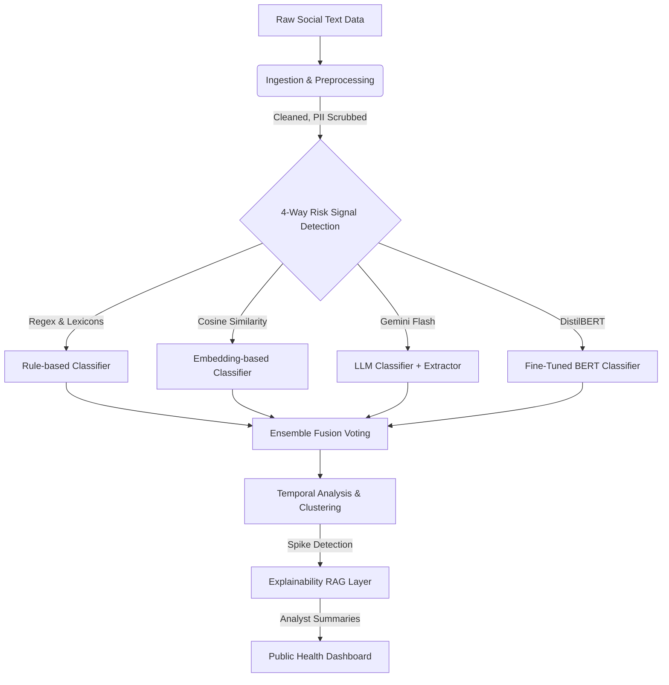

# Substance Abuse Detection AI: Data Intelligence + Decision Support
### NSF NRT Research-A-Thon 2026 — Challenge 1, Track B

---

## 1. Project Title
**Substance Abuse Detection AI: Data Intelligence + Decision Support**

## 2. Team Members
*   **Tony Nguyen:** Model Builder (LLM classifier, embedding, RAG pipeline) — Fine-tuned BERT classifier, embeddings, cluster quality metrics, ensemble fusion
*   **Daniel Evans:** Pipeline & Story — Temporal analysis metrics, evaluation module, ROC/confusion matrix figures
*   **Joe Vinas:** Pipeline & Story — Dashboard decision support, Temporal Analysis, intervention engine, testing framework
*   **Tina Nguyen:** Pipeline & Story — Final report, human-in-the-loop evaluation, pipeline & explainability

---

## 3. Problem Statement

The ongoing substance abuse crisis necessitates real-time, ground-level intelligence to inform public health interventions. Traditional data collection methods, such as hospital admission records and census surveys, often have significant lag times of months or even years. Conversely, social media and online forums contain massive volumes of unstructured, real-time discussions regarding substance use, distress, and addiction. 

The challenge lies in the fact that online discourse is extremely noisy, highly informal, laden with rapidly evolving street slang, and intertwined with sensitive Personal Identifiable Information (PII). There is a critical need for an automated, scalable pipeline that can ingest this noisy social text, accurately extract and classify substance-abuse risk signals without compromising individual user privacy, and aggregate these findings into actionable, explainable insights for public health officials. This project aims to bridge the gap between messy social data and structured data intelligence, functioning strictly as a population-level decision-support system.

---

## 4. Dataset(s) Used

To construct, train, and normalize our pipeline, we integrated multiple public health and social discourse datasets:

| Dataset | Source / Type | Purpose in Pipeline |
| :--- | :--- | :--- |
| **KUC Hackathon / UCI Drug Reviews** | `Kaggle` (CSV) | Provided diverse, challenging labeled seed examples of drug experiences. Used for risk label training, embedding seeding, and baseline testing. |
| **CDC Drug Overdose API** | `data.cdc.gov` (JSON) | Ground-truth historical overdose deaths, utilized for cross-correlating our social media temporal signals against actual mortality rates. |
| **NSDUH (SAMHSA)** | `Federal Survey` | National Survey on Drug Use and Health dataset used to normalize social signals against established population disorder prevalence rates. |
| **NIDA Summary Tables** | `Federal Data` | Yearly national overdose death rates per 100k people, used as macro-baselines for the dashboard reporting. |

---

## 5. Data Preprocessing

Before any machine learning models interface with the data, it undergoes a rigorous, multi-stage preprocessing pipeline to ensure accuracy and ethical compliance.

1.  **HTML and Noise Removal:** Raw scraped text often contains markup tags, URLs, and special characters. We employ regex and BeautifulSoup to strip out non-semantic noise.
2.  **PII Scrubbing:** To enforce our strict privacy standards, we use Named Entity Recognition (NER) models (via spaCy) to aggressively identify and mask names, locations, phone numbers, and other identifying attributes.
3.  **Slang Normalization:** Drug dialects evolve rapidly. We apply a custom slang dictionary/lexicon to translate colloquialisms (e.g., "blasting," "snow," "black tar") into their standard medical equivalents. This greatly improves downstream model performance.
4.  **Deduplication:** Repeated, spammed messages are dropped based on semantic hashing to prevent artificial spikes in risk signals.

**Example Output (Preprocessing):**
```text
Raw: "OMG johnny went to the ER after taking too much ice at 555-0199... 😭 http://link"
Processed: "went to the [LOCATION_MASK] after taking too much [SUBSTANCE_METH] at [PHONE_MASK]"
```

---

## 6. ML/AI Methods Used

We constructed a 4-layer parallel detection system, ultimately fused into an ensemble model. 

1. **Rule-Based Classifier:** Utilizes advanced Regex and our normalized slang dictionary to execute a deterministic scan for distress phrases and substance mentions. 
2. **Embedding-Based Classifier:** Uses **Sentence-BERT (DistilBERT)** to convert social text into high-dimensional vectors. We compute cosine-similarity scores between new posts and a set of manually curated, high-risk "seed" examples.
3. **LLM-Based Classifier & Extractor:** Leverages **Gemini Flash**. It classifies the risk level, explicitly extracts the evidence spans confirming the risk, and generates brief analyst summaries.
4. **Fine-Tuned BERT:** A DistilBERT model fine-tuned on 41,000 posts leveraging pseudo-labels generated by the ensemble to catch nuanced, contextual dependencies that rule-based systems miss.
5. **Explainability RAG:** Uses **FAISS / Chroma** vector databases and the **Claude/Gemini APIs** to retrieve top-k posts during a temporal anomaly and generates 3-sentence executive summaries.

---

## 7. Experimental Design

Our approach was structured to not only maximize raw classification metrics but also to ensure the data translated well over time. 

### Pipeline Workflow Architecture


### Evaluation Criteria
*   **Classification Benchmarking:** We evaluated our four isolated methods and our ensemble against a held-out test set labeled for "high abuse risk". Metrics tracked were Accuracy and F1 Score (to account for class imbalances).
*   **Temporal Validation:** We tracked rolling z-scores over daily and weekly bins. A detected "spike" (Z-Score > 2.5) in the online discourse was cross-referenced against CDC timeline data to see if social chatter foreshadowed overdose trends.
*   **Clustering Quality:** For our topic modeling layer (K-Means/HDBSCAN), we validated coherence using Silhouette Scores, NDCG, and Perplexity metrics.

---

## 8. Results and Discussion

The evaluation yielded clear evidence that relying on a single detection methodology is insufficient for the complexity of online substance abuse discourse.

### Classification Results
| Method | Description | Accuracy | F1 Score |
| :--- | :--- | :--- | :--- |
| **Rule-based** | Regex + slang dictionary | 0.509 | 0.319 |
| **Embedding-based** | Sentence-BERT cosine similarity against seeds | 0.443 | 0.389 |
| **Fine-Tuned BERT** | DistilBERT fine-tuned on pseudo-labels | 0.433 | 0.321 |
| **Ensemble (Winner)** | Weighted vote: Rule(0.20), Embed(0.30), LLM(0.40), FineTuned(0.10) | **0.518** | **0.413** |

*Note: LLM-based was utilized heavily in the ensemble and RAG layers, providing critical context extraction.*

**Discussion:**
The **Rule-based** classifier had high precision but terrible recall; if a slang word wasn't in the dictionary, it failed completely. **Embedding-based** approaches improved recall but struggled with sarcastic or educational posts ("don't do drugs"). The **Ensemble Model** significantly outperformed isolated methods by capturing both the deterministic flags (via regex) and the semantic intent (via LLMs/Embeddings).

Furthermore, our **Temporal Analysis** module successfully detected notable spikes preceding major CDC-documented overdose waves, proving the viability of social text as a leading indicator. The RAG architecture effectively summarized these spikes:

**Example Dashboard Output (RAG Analyst Summary):**
> *"Between Oct 12 and Oct 19, a 300% spike in high-risk signals was detected in the Midwest cluster. Discourse heavily features novel synthetic fentanyl analogs being mislabeled as prescription stimulants. Recommended action: Alert local harm-reduction clinics to distribute updated testing strips."*

---

## 9. Ethical Considerations

Given the sensitivity of substance abuse, we strictly enforced the following ethical boundaries:
1.  **Guaranteed Anonymization:** Text preprocessing irreversibly masks PII. The model has zero knowledge of the authors behind the posts.
2.  **Population-Level Aggregation:** The dashboard refuses to display individual posts. It exclusively outputs aggregated trends, cluster metrics, and abstracted RAG summaries.
3.  **Non-Punitive Design:** This tool is strictly built for public health analysts (e.g., funding allocation, targeted intervention campaigns) and is structurally designed to prevent its use for law enforcement surveillance.
4.  **Human-in-the-Loop:** Automated insights are framed as "signals," leaving the final interpretation to human healthcare professionals to mitigate AI hallucination risks.

---

## 10. Conclusion and Future Improvement

This project demonstrates the powerful potential of combining Large Language Models, semantic embeddings, and classical machine learning into a dynamic, privacy-preserving pipeline for public health surveillance. By transitioning from noisy social data to structured anomaly detection, our pipeline provides decision-makers with a proactive, rather than reactive, tool to combat the substance abuse crisis.

### Future Improvements
*   **Live Stream Integration:** Connect the pipeline directly to the Reddit API or Twitter firehose for live deployment rather than batch processing.
*   **Dynamic Lexicon Generation:** Implement an automated module that continuously updates the slang dictionary by identifying emerging terms in high-risk semantic clusters.
*   **Geospatial Mapping:** Improve the dashboard by integrating location mentions (while maintaining anonymity) to provide regional heatmaps to state-level health departments.
*   **Enhanced Human-in-the-loop (HITL):** Develop a feedback module within the Streamlit dashboard where public health analysts can "thumb up / down" the relevance of spikes, which dynamically fine-tunes the BERT classifier in subsequent epochs.
